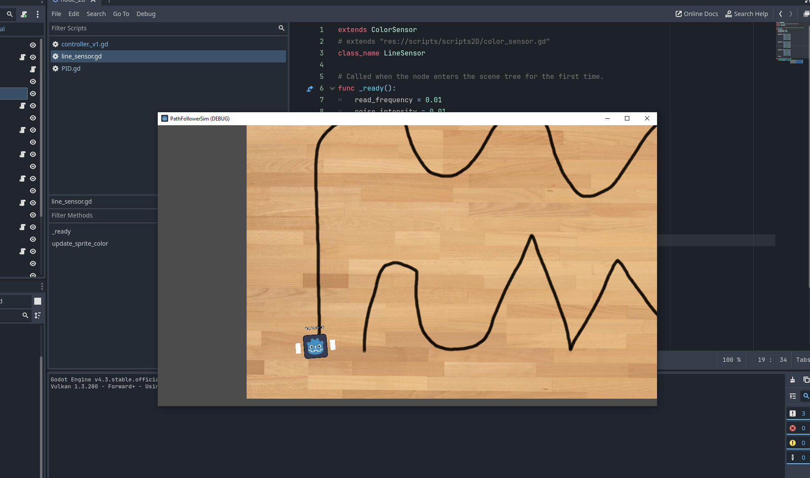

# 🧭 Godot Line Follower Simulator

This is a **2D simulator** of a **line follower robot**, built with the **Godot Engine**. It was created for a **robotics competition** and is intended to provide a fast and flexible way to **test control algorithms** for a two-wheeled robot using **ESP32**.



## 🎯 Purpose

The main goal of this simulator is to **speed up the development process** by allowing developers to test robot logic in a virtual environment without needing to upload code to a physical robot after each change.

## ⚙️ Features

- 🔧 **Configurable sensors and motors**  
  You can freely place and configure line sensors and motors on the robot.

- ➖ **Two-motor support**  
  Currently, the simulator supports **two motors placed on a single axis**. You can configure the **distance between the motors** to simulate different chassis layouts.

- 🎛️ **Sensor behavior customization**  
  The simulator allows you to tweak how sensors read the environment:

  - Adjust **refresh frequency** (how often sensors take new readings)
  - Control how sensors **sample the track** by averaging color values from **neighboring pixels**.

- 🧪 **PID control support**  
  Ready for testing PID control algorithms in real-time with tunable parameters.

- 🧱 Designed with expandability in mind  
  The project is structured to allow future features such as obstacle detection, map editing, or serial communication emulation.

## 📦 Technologies Used

- [Godot Engine 4.x](https://godotengine.org/)
- GDScript
- 2D Physics and Rendering

## 🚀 Getting Started

1. Clone the repository:
   ```bash
   git clone https://github.com/your-username/godot-line-follower-simulator.git
   ```
